# Introduction to Networks and Decision Mathematics

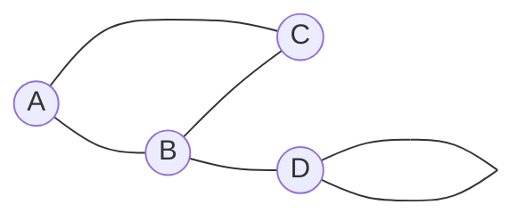

<v-clicks>

- **Graph**: A collection of vertices (nodes) and edges (connections)
- **Vertices**: A, B, C, D (the nodes). (**Verticees** is plural, **vertex** is singular)
- **Edges**: A–B, A–C, B–C, B–D (the connections)
- **Degree of a vertex**: The number of connections to that vertex
    - deg(A) = 2, deg(B) = 3, deg\(C\) = 2, deg(D) = 3
- **Loop**: An edge that connects a vertex to itself
    - deg(D) = 3 because the loop counts as 2 connections

</v-clicks>

---
layout: two-cols-header
---

# Graph Types

::left::

## Connected Graph

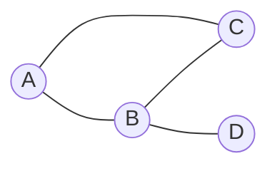

In a **connected graph**, there is a path between every pair of vertices.

::right::

## Disconnected Graph

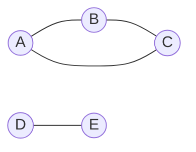

It is rare to use a **disconnected graph** in General Maths, but it is possible.

A graph is **disconnected** if there is at least one vertex that cannot be reached from another vertex.

---
layout: two-cols-header
---

# Graph Types (cont)

::left::

### Complete Graph

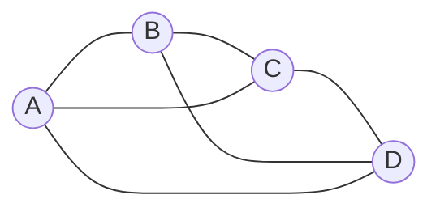

A **complete graph** is a connected graph where **every vertex is directly connected** to every other vertex.

> [!IMPORTANT]
> The number of edges in a complete graph with n vertices is given by the formula: 
>
> $e=\frac{n(n-1)}{2}$

::right::

### Simple Graph

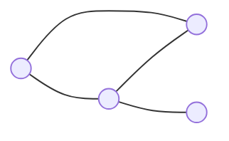

A **simple graph** is a graph with **no loops** (edges that connect a vertex to itself) and **no multiple edges** (more than one edge connecting the same pair of vertices).

> [!NOTE]
> The labelling of vertices (or lack of labels) does not affect the graph type. We will use a combination of labelled and unlabelled graphs in this course.

---
layout: center
zoom: 1.2
---

# Mini-whiteboard check

Draw a complete graph with 5 vertices

Underneath, identify whether the graph is:

- Connected or disconnected
- Simple or not

<CountdownTimer :seconds="120" @finish="onTimerFinish" />

---
layout: two-cols-header
---

# Graph Types (cont)

::left::

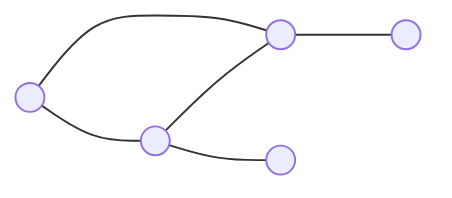

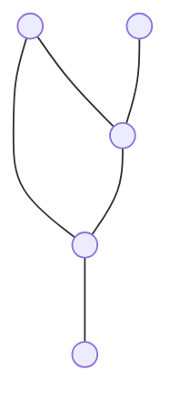

::right::

### Isomorphic Graphs

Two graphs are **isomorphic** if they have the same number of vertices and edges, and the same connections between vertices.

Isomporphic graphs are structurally the same as one another, but may be drawn differently.

> [!NOTE]
> When graphs are labelled, there can be controversy about whether the labels need to match for the graphs to be considered isomorphic. In General Maths we usually use unlabelled graphs when discussing isomorphism.

---
layout: two-cols-header
zoom: 0.9
---

# Planar graphs

A **planar graph** is a graph that can be drawn without any edges crossing (except at vertices).

::left::

This graph is **planar** because the edges aren't crossing.

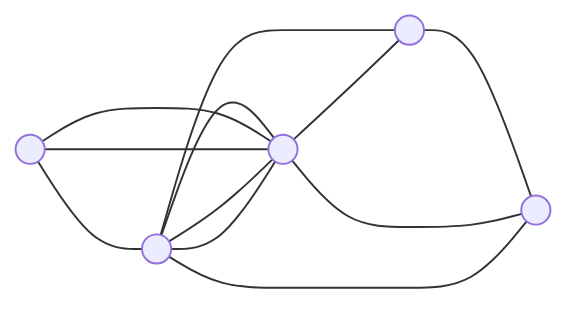

This graph is **not planar** because the edges are crossing. It cannot be redrawn in planar form without changing the connections.

::right::

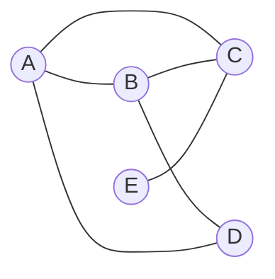

*Even though this graph is drawn with edges crossing*, it is still **planar** because it can be redrawn in planar form (without changing any of the connections). 

---
layout: two-cols-header
zoom: 1.2
---

# Bridges

::left::

A **bridge** is an **edge** in a connected graph that, if removed, would make the graph disconnected.

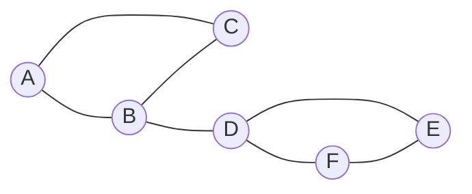

The edge `BD` is a **bridge** because if it is removed, the graph becomes disconnected.

::right::

<v-clicks>

### Try together

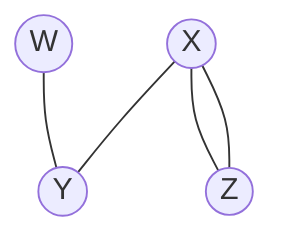

**Find the bridge(s)**

- Removing WY would disconnect the graph, so **WY is a bridge**.
- Removing XY would disconnect the graph, so **XY is a bridge**.

</v-clicks>

---
layout: two-cols-header
---

# Faces

The **faces** of a planar graph are the *regions formed by the edges*, including the outer region.

::left::

**There are two faces in this graph:**
- The inner face (the triangle formed by A, B, and C)
- The outer face (the region outside the triangle)

::right::

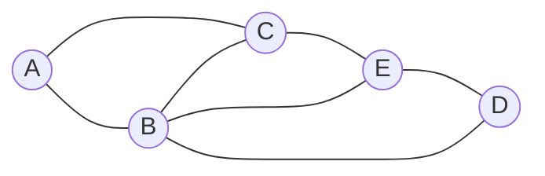

There are **four faces in this graph:**

- The region inside A, B, C
- The region inside B, C, E
- The region inside B, D, E
- The outer face (the region outside the graph)

---
layout: center
---

# Euler's formula

For any **connected planar graph**, the number of vertices \(v\), edges \(e\), and faces \(f\) are related by **Euler's formula**:

$v - e + f = 2$

### This means we can:

- Check whether a graph is planar without needing to draw it in planar form
- Identify the number of faces, edges, or vertices in a planar graph if we know the other two values.

> [!NOTE]
> **Leonhard Euler** (1707–1783) was a Swiss mathematician who made important discoveries in many areas of mathematics, including founding graph theory (the basis of our Networks and Decisions unit). Euler will show up again.
---
layout: two-cols-header
---

# Using Euler's formula

::left::

A connected planar graph has 10 vertices and 15 edges. How many faces does it have?

<v-clicks>

$v - e + f = 2$

$v = 10, e = 15$

$10 - 15 + f = 2$

$- 15 + f = 2 - 10$

$f = 2 - 10 + 15$

$f = 7$

7 faces

</v-clicks>

::right::

A connected planar graph has 8 faces and 12 edges. How many vertices does it have?

<v-clicks>

$v - e + f = 2$

$e = 12, f = 8$

$v - 12 + 8 = 2$

$v - 4 = 2$

$v = 6$

6 vertices

</v-clicks>

