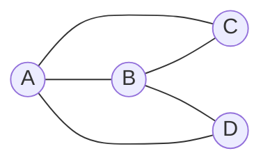
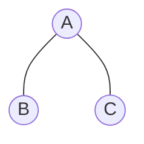
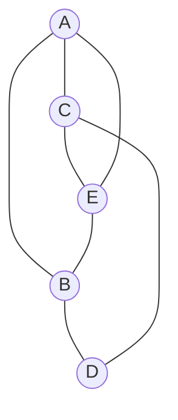
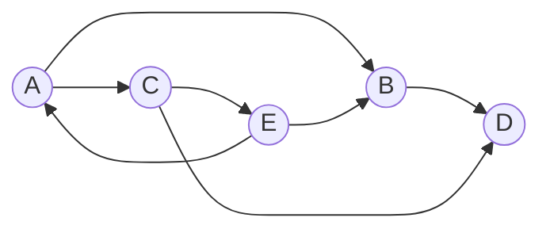

# Graphs as Matrices

$$
\begin{array}{r c}
& \begin{array}{cccc} A & B & C & D \end{array} \\
\begin{array}{c} A \\ B \\ C \\ D \end{array} &
\begin{bmatrix}
0 & 1 & 1 & 0 \\
1 & 0 & 1 & 1 \\
1 & 1 & 0 & 0 \\
0 & 1 & 0 & 0
\end{bmatrix}
\end{array}
$$

---
layout: center
zoom: 1.2
---

# Adjacency Matrices

*You thought you were finished with matrices!*

An **adjacency matrix** is a square matrix that represents the connections between each vertex in a graph. 

- The rows and columns of the matrix represent the vertices of the graph.
- The entries of the matrix represent the number of connections (edges) between the vertices. For a simple graph, the entries are either 0 (no connection) or 1 (connection).

<table>
<tbody>
<tr>
<td>

$$
\begin{array}{r c}
& \begin{array}{ccc} A & B & C  \end{array} \\
\begin{array}{c} A \\ B \\ C \end{array} &
\begin{bmatrix}
0 & 1 & 1  \\
1 & 0 & 0  \\
1 & 0 & 0 
\end{bmatrix}
\end{array}
$$

</td>
<td>

**Draw the graph:**

<v-click>

</v-click>
</td>
</tr>
</tbody>
</table>

---
layout: two-cols
zoom: 0.95
---

# More Practice

**Q1.** Identify the adjacency matrix for the following graph:

::right::

**Q2.** Draw the graph for the following adjacency matrix:

$$
\begin{array}{r c}
& \begin{array}{cccc} A & B & C & D \end{array} \\
\begin{array}{c} A \\ B \\ C \\ D \end{array} &
\begin{bmatrix}
    0 & 1 & 1 & 0 \\
    1 & 0 & 0 & 1 \\
    1 & 0 & 0 & 1 \\
    0 & 1 & 1 & 0
\end{bmatrix}
\end{array}
$$

**Q3.** How many edges would be in the graph represented by the following adjacency matrix?

$$
\begin{array}{r c}
& \begin{array}{ccc} A & B & C \end{array} \\
\begin{array}{c} A \\ B \\ C \end{array} &
\begin{bmatrix}
    0 & 1 & 1 \\
    1 & 1 & 1  \\
    1 & 1 & 0  
\end{bmatrix}
\end{array}
$$

**Q4.** For the adjacency matrix in Q3 - which vertex has a loop?
---
layout: center
---

# Things to note about adjacency matrices

- A loop (an edge that connects a vertex to itself) is represented by a 1 in the diagonal of the matrix. 
    - Loops are the only edges that are represented in the diagonal of the adjacency matrix.
- The adjacency matrix of a simple graph is symmetric about the diagonal. 
    - Edges are undirected, so the connection from vertex A to vertex B is the same as the connection from vertex B to vertex A.
- We can use adjacency matrices to represent **directed graphs**, but the adjacency matrix will not be symmetric in that case.

---
layout:center
---

# Directed Graphs

**Directed graphs** (or **digraphs**) have directed edges (arrows) that indicate the direction of the connection between vertices. 

---