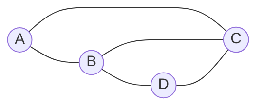
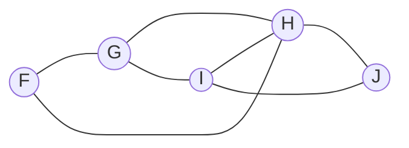

# Traversing Graphs

---
layout: center
---

# Traversing Graphs

- **Walk**: A sequence of vertices and edges that can be followed in a graph
- **Path**: A walk where all vertices are distinct
- **Trail**: A walk where all edges are distinct
- **Cycle**: A path that starts and ends at the same vertex
- **Circuit**: A trail that starts and ends at the same vertex

> [!TIP]
> The definitions of walk, path, trail, cycle, and circuit are easy to ignore, but are **always used deliberately**. Check in with your notes if you don't remember the difference when answering a question. 

---
layout: center
zoom: 0.95
---

## Example

> [!TIP]
> **Paths and cycles** are about vertices. **Trails and circuits** are about edges. 

<v-clicks> 

| Sequence      | Walk? | Path? | Trail? | Cycle? | Circuit? |
|---------------|-------|-------|--------|--------|----------|
| A, B, C       | ✅    | ✅    | ✅     | ❌     | ❌       |
| A, B, D       | ✅    | ✅    | ✅     | ❌     | ❌       |
| A, B, C, D, B | ✅    | ❌    | ✅     | ❌     | ❌       |
| A, B, C, A    | ✅    | ❌*   | ✅     | ✅     | ✅       |

</v-clicks>

---
layout: center
---

# Try it now

For each, identify which labels apply: **Walk, Path, Trail, Cycle, Circuit**.

1. F, G, H, I, J
2. G, H, I, J
3. F, I, H, J
4. G, I, H, G
5. J, I, H, J, I

---
