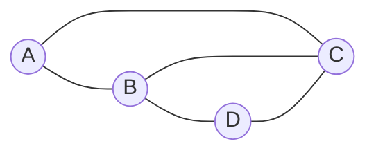
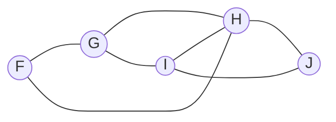
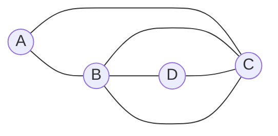

# Traversing Graphs

---
layout: center
---

# Traversing Graphs

- **Walk**: A sequence of vertices and edges that can be followed in a graph
- **Path**: A walk where all vertices are distinct
- **Trail**: A walk where all edges are distinct
- **Cycle**: A path that starts and ends at the same vertex
- **Circuit**: A trail that starts and ends at the same vertex

> [!TIP]
> The definitions of walk, path, trail, cycle, and circuit are easy to ignore, but are **always used deliberately**. Check in with your notes if you don't remember the difference when answering a question.

---
layout: center
zoom: 0.95
---

## Example

> [!TIP]
> **Paths and cycles** are about vertices. **Trails and circuits** are about edges.

<v-clicks>

| Sequence      | Walk? | Path? | Trail? | Cycle? | Circuit? |
|---------------|-------|-------|--------|--------|----------|
| A, B, C       | ✅    | ✅    | ✅     | ❌     | ❌       |
| A, B, D       | ✅    | ✅    | ✅     | ❌     | ❌       |
| A, B, C, D, B | ✅    | ❌    | ✅     | ❌     | ❌       |
| A, B, C, A    | ✅    | ❌*   | ✅     | ✅     | ✅       |

</v-clicks>

---
layout: center
---

# Try it now

For each, identify which labels apply: **Walk, Path, Trail, Cycle, Circuit**.

1. F, G, H, I, J
2. G, H, I, J
3. F, I, H, J
4. G, I, H, G
5. J, I, H, J, I

---
layout: two-cols-header
---

# Eulerian Trails

*Euler is back!*

An **Eulerian trail** is a trail that uses **every edge** of a graph exactly once.

::left::

For example, in this graph:

The following is an Eulerian trail:

<v-clicks>

**B, A, C, D, B, C**

</v-clicks>

::right::

> [!TIP]
> An Eulerian trail only exists if the graph has **exactly  2 vertices of odd degree** (odd vertices).
>
> The odd vertices are always the starting and ending vertices on the trail.

---
layout: two-cols-header
---

# Eulerian Circuit

An **Eulerian circuit** is a circuit (so it starts and ends at the same vertex) that uses **every edge** of a graph exactly once.

::left::

For example, in this graph:

**The following is an Eulerian circuit:**

<v-clicks>

**B, A, C, D, B, C, B**

</v-clicks>

::right::

> [!TIP]
> An Eulerian circuit only exists if the graph has **no vertices of odd degree** (no odd vertices)

> [!IMPORTANT]
> If you are asked to modify an existing graph to create an Eulerian trail or circuit, you add edges to connect odd vertices until there are only  2 left (for a trail) or 0 (for a circuit).

---
layout: center
---

# Hamiltonian Paths and Cycles

A **Hamiltonian path** is a path that visits **every vertex** of a graph exactly once.

A **Hamiltonian cycle** is a cycle that visits **every vertex** of a graph exactly once (with the same start and end vertex).

There is no simple rule for finding a Hamiltonian path or cycle, but check that:

- All vertices are visited
- No vertex is visited more than once (except for the start/end vertex in a cycle)

Possible Hamiltonian path: **A, B, C, D**. Possible Hamiltonian cycle: **A, B, D, C, A**.

---
layout: center
zoom: 1.6
---

# Questions

## Edrolo 8C, p. 555

Questions 2, 3, 5-7, 13-16.
