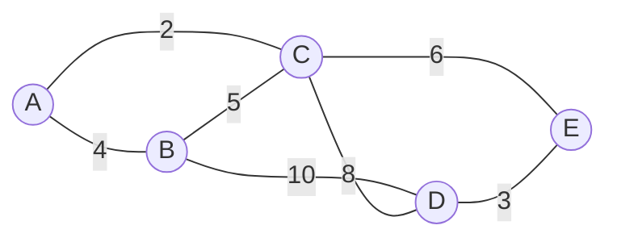
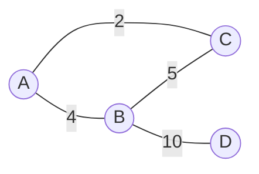
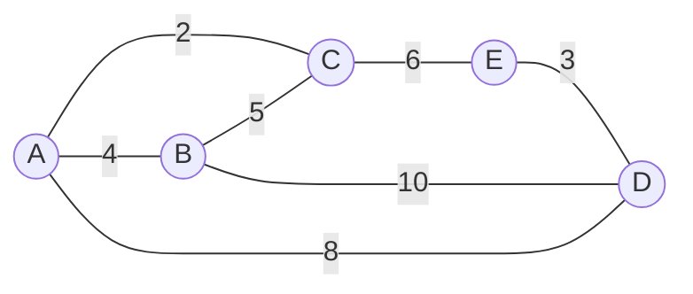
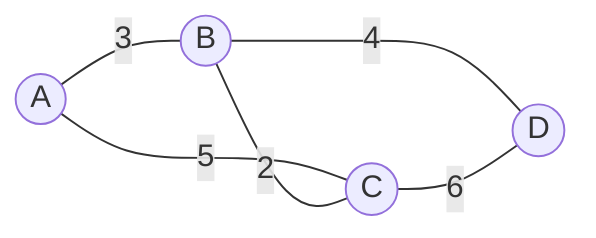
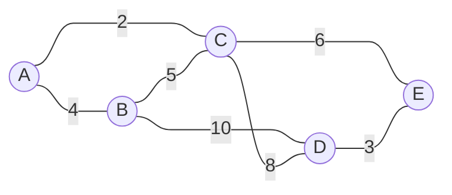
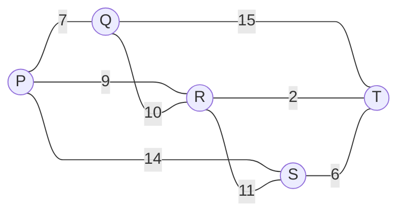

# Minimum Connector Problems

---
layout: center
zoom: 1.2
---

# Weighted Graphs (Networks)

A **network** is a graph where each edge has a **weight** — a number representing cost, distance, time, or some other quantity.

> [!NOTE]
> Networks are used to model real situations — for example, the weights above could represent the cost (in $1000s) of laying cable between buildings A–E.

---
layout: two-cols-header
---

# Subgraphs

A **subgraph** is a graph formed using a subset (some of) the vertices and edges of a larger graph.

::left::

**Example**

**This graph is a subgraph...**

::right::

**...of this graph.** The subgraph contains only some of the vertices and edges of the larger graph. 

None of the edges or vertices in the subgraph are new. They all exist in the larger graph.

---
layout: center
zoom: 1.3
---

# Trees

A **tree** is a **connected graph** with:

- no cycles
- exactly $n - 1$ edges, where $n$ is the number of vertices
- no loops or multiple edges

Trees are a special type of graph, often used for representing hierarchical structures (e.g., family trees, decision trees)

---
layout: center
zoom: 1.2
---

# Spanning Trees and Minimum Spanning Trees

A **spanning tree** is a subgraph that:

- Connects **every vertex** of the original graph
- Contains **no cycles**
- Uses exactly $n - 1$ edges, where $n$ is the number of vertices

<v-clicks>

There can be **many different spanning trees** for the same graph.

The **minimum spanning tree** (also called the **minimum connector**) is the spanning tree with the **smallest possible total weight**.

</v-clicks>

---
layout: two-cols-header
zoom: 1.3
---

# Many spanning trees, one minimum

::left::

*The original network*

::right::

<v-clicks>

**Spanning tree 1:** AB, BC, BD

Total weight: $3 + 2 + 4 = 9$

**Spanning tree 2:** AC, BC, CD

Total weight: $5 + 2 + 6 = 13$

Spanning tree 1 has the smaller total weight, so it is the **minimum spanning tree**.
</v-clicks>

---
layout: center
---

# Prim's Algorithm

**Prim's algorithm** finds a minimum spanning tree by growing the tree one vertex at a time.

<v-clicks>

1. Choose **any starting vertex** — it doesn't matter which one.
2. Look at all edges connecting a vertex **already in the tree** to a vertex **not yet in the tree**. Add the **cheapest** of these edges (and its new vertex) to the tree.
3. Repeat step 2, **avoiding any edge that would create a cycle**.
4. Stop once **every vertex** is included in the tree.

</v-clicks>

> [!NOTE]
> A minimum spanning tree for a network with $n$ vertices will always have exactly $n - 1$ edges.

---
layout: two-cols
zoom: 0.95
class: ns
---

# Worked Example

::right::

**Apply Prim's algorithm, starting at A.**

<v-clicks depth='3'>

1. Cheapest available edge: AC
    - Weight: 2
    - Vertex added: C
2. Cheapest available edge: AB
    - Weight: 4
    - Vertex added: B
3. Cheapest available edge: CE
    - Weight: 6
    - Vertex added: E
4. Cheapest available edge: ED
    - Weight: 3
    - Vertex added: D

**Minimum spanning tree:** AC, AB, CE, ED

**Total weight:** $2 + 4 + 6 + 3 = 15$

</v-clicks>

---
layout: two-cols-header
zoom: 0.95
---

# Practice

::left::

**Use Prim's algorithm, starting at P, to find the minimum spanning tree.**

::right::

<v-clicks depth='3'>

1. Cheapest available edge: PQ
    - Weight: 7
    - Vertex added: Q
2. Cheapest available edge: PR
    - Weight: 9
    - Vertex added: R
3. Cheapest available edge: RT
    - Weight: 2
    - Vertex added: T
4. Cheapest available edge: ST
    - Weight: 6
    - Vertex added: S

**Minimum spanning tree:** PQ, PR, RT, ST

**Total weight:** $7 + 9 + 2 + 6 = 24$

</v-clicks>

---
layout: center
---

# Things to note

- A tree (including any minimum spanning tree) always has $n - 1$ edges for $n$ vertices — **never more**.
- If the graph is not connected, no spanning tree exists — the network must be **connected** to begin with.
- Prim's algorithm works from **any** starting vertex — the resulting minimum weight will always be the same, even if the exact edges chosen differ when there are ties.

> [!TIP]
> You won't always be asked for the "minimum spanning tree". Examples you might be asked for instead:
> 
> - the lowest cost to connect all vertices
> - the minimum total weight of a spanning tree
> - the shortest total distance to connect all vertices

---
layout: center
zoom: 1.6
---

# Questions

## Edrolo 8D, p. 567

Questions 1, 4, 5, 7, 9, 12, 13
