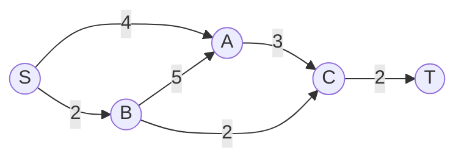
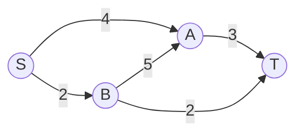

# Flow Problems

---
layout: center
zoom: 1.2
---

# Network Flow

- Network Flow problems occur in  directed, weighted graphs where edge weights represent **capacity**.
- The **source** ($S$) is the vertex where flow begins.
- The **sink** ($T$) is the vertex where flow ends.



Flow problems seek to find the **maximum flow** from the source to the sink, understanding that capacities limit the flow along each edge.

---
layout: center
zoom: 1.2
---

# Why is Flow Important?

- Flow problems are important in many real-world applications, including:
  - Traffic flow
  - Water distribution
  - Internet data routing
- Bottlenecks in flow occur when one part of a network has a lower capacity than the rest, restricting the overall flow.

> When a whole network is considered, the **maximum flow is equal to the minimum cut** capacity.

---
layout: center
zoom: 1.2
---

# Cuts and Cut Capacity

- A **cut** separates the source from the sink, dividing the vertices into two groups.
- The **capacity of a cut** is the sum of the capacities of edges crossing from the source side to the sink side.



---
layout: center
zoom: 1.2
---

# Maximum-Flow Minimum-Cut Theorem

-

> [!TIP]
>

---
layout: two-cols
zoom: 0.95
---

# Worked Example


::right::

**Find the maximum flow from S to T.**

<v-clicks>

1.
2.
3.

**Maximum flow:**

</v-clicks>

---
layout: two-cols-header
zoom: 0.95
---

# Practice

::left::

```mermaid {scale: 1.1}
graph LR

```

**Find the maximum flow.**

::right::

<v-clicks>

</v-clicks>

---
layout: center
---

# Things to note

-
-
-

---
layout: center
zoom: 1.6
---

# Questions

## Edrolo p. TBC

Questions TBC
