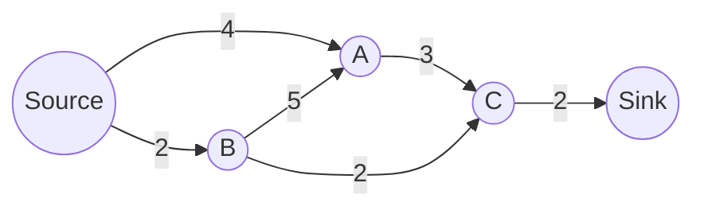
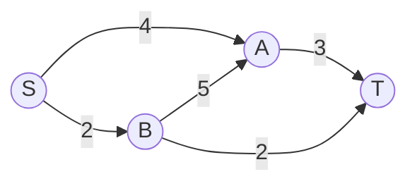

# Flow Problems

---
layout: two-cols-header
zoom: 1
---

# Revision: Recursion and Finance

::left::
For the recurrence relation below:

$$
F_0 = 25000, \qquad F_{n+1} = 1.006\,F_n
$$

where $n$ represents number of months after January 2024.

1. What type of financial scenario is this recurrence relation most likey modelling?
2. Describe what each number in the recurrence relation represents.
3. Calculate the value of $F_3$.
4. Find the annual interest rate represented by this recurrence relation.

::right::

<v-clicks>
<div class="note">

1. Compound interest. (Geometric Growth)
2. 25000 is the initial investment ($25,000). 1.006 means that the monthly interest rate is 0.6% (or 0.006 as a decimal).
3. $F_3 = 1.006^3 \times 25000$

$= 1.0181 \times 25000 = 25452.50$

4. The annual interest rate is

 $1.006^{12} - 1 = 0.0743$ or 7.43%.

</div>
</v-clicks>
---
layout: center
zoom: 1.2
---

# Network Flow

- Network Flow problems occur in **directed**, **weighted** graphs where edge weights represent **capacity**.
- The **source** ($S$) is the vertex where flow begins.
- The **sink** ($T$) is the vertex where flow ends.



Flow problems seek to find the **maximum flow** from the source to the sink, understanding that capacities limit the flow along each edge.

---
layout: center
zoom: 1.2
---

# Why is Flow Important?

- Flow problems are important in many real-world applications, including:
  - Traffic flow
  - Water distribution
  - Internet data routing
- Bottlenecks in flow occur when one part of a network has a lower capacity than the rest, restricting the overall flow.

> When a whole network is considered, the **maximum flow is equal to the minimum cut** capacity.

---
layout: center
zoom: 1.2
---

# Where is the bottleneck?


Which edge is the bottleneck in this network?

<v-clicks>

- 4 capacity can get to A from S, but A can only send 3 to C. So **A -> C** is a bottleneck.
- B could send 5 to A, but it only has 2 coming in, so **B -> A** is not a bottleneck.
- A can send 3 to C, B can send to to C, but only 2 can continue to T. So **C -> T** is a bottleneck.

</v-clicks>

---
layout: center
zoom: 1.2
---

# Cuts and Cut Capacity

- A **cut** separates the source from the sink, dividing the vertices into two groups.
- The **capacity of a cut** is the sum of the capacities of edges crossing from the source side to the sink side.

<FlowNetwork
  :nodes="[
    { id: 'S', label: 'Source', x: 85, y: 110 },
    { id: 'A', label: 'A', x: 270, y: 50 },
    { id: 'B', label: 'B', x: 270, y: 170 },
    { id: 'T', label: 'Sink', x: 445, y: 110 },
  ]"
  :edges="[
    { from: 'S', to: 'A', capacity: 4 },
    { from: 'S', to: 'B', capacity: 2 },
    { from: 'A', to: 'T', capacity: 3 },
    { from: 'B', to: 'A', capacity: 5 },
    { from: 'B', to: 'T', capacity: 2 },
  ]"
  :width="520"
  :cuts="[{ x1: 160, y1: 25, x2: 160, y2: 210, label: 'Cut' }]"
/>

---
layout: center
zoom: 1.2
---

# Maximum-Flow Minimum-Cut Theorem

-

> [!TIP]
>

---
layout: two-cols
zoom: 0.95
---

# Worked Example



::right::

**Find the maximum flow from S to T.**

<v-clicks>

1.
2.
3.

**Maximum flow:**

</v-clicks>

---
layout: two-cols-header
zoom: 0.95
---

# Practice

::left::

```mermaid {scale: 1.1}
graph LR

```

**Find the maximum flow.**

::right::

<v-clicks>

</v-clicks>

---
layout: center
---

# Things to note

-
-
-

---
layout: center
zoom: 1.6
---

# Questions

## Edrolo p. TBC

Questions TBC
