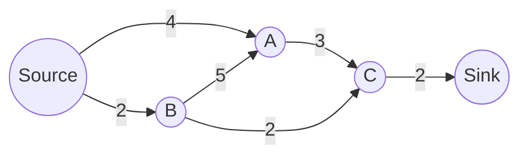

# Flow Problems

---
layout: two-cols-header
zoom: 1
---

# Revision: Recursion and Finance

::left::
For the recurrence relation below:

$$
F_0 = 25000, \qquad F_{n+1} = 1.006\,F_n
$$

where $n$ represents number of months after January 2024.

1. What type of financial scenario is this recurrence relation most likey modelling?
2. Describe what each number in the recurrence relation represents.
3. Calculate the value of $F_3$.
4. Find the annual interest rate represented by this recurrence relation.

::right::

<v-clicks>

1. Compound interest. (Geometric Growth)
2. 25000 is the initial investment ($25,000). 1.006 means that the monthly interest rate is 0.6% (or 0.006 as a decimal).
3. $F_3 = 1.006^3 \times 25000$

$= 1.0181 \times 25000 = 25452.71$

4. The annual interest rate is

$0.6 \% \times 12 = 7.2\%$

</v-clicks>
---
layout: center
zoom: 1.2
---

# Network Flow

- Network Flow problems occur in **directed**, **weighted** graphs where edge weights represent **capacity**.
- The **source** ($S$) is the vertex where flow begins.
- The **sink** ($T$) is the vertex where flow ends.

Flow problems seek to find the **maximum flow** from the source to the sink, understanding that capacities limit the flow along each edge.

---
layout: center
zoom: 1.2
---

# Why is Flow Important?

- Flow problems are important in many real-world applications, including:
  - Traffic flow
  - Water distribution
  - Internet data routing
- Bottlenecks in flow occur when one part of a network has a lower capacity than the rest, restricting the overall flow.

> When a whole network is considered, the **maximum flow is equal to the minimum cut** capacity.

---
layout: center
zoom: 1.2
---

# Where is the bottleneck?

Which edge is the bottleneck in this network?

<v-clicks>

- 4 capacity can get to $A$ from $S$, but $A$ can only send 3 to $C$. So **$A$ -> $C$** is a bottleneck.
- $B$ could send 5 to $A$, but it only has 2 coming in, so **$B$ -> $A$** is not a bottleneck.
- $A$ can send 3 to $C$, $B$ can send to to $C$, but only 2 can continue to $T$. So **$C$ -> $T$** is a bottleneck.

</v-clicks>

---
layout: center
zoom: 1.2
---

# Cuts and Cut Capacity

- A **cut** separates the source from the sink, dividing the vertices into two groups.
- The **capacity of a cut** is the sum of the capacities of edges crossing from the source side to the sink side.

<FlowNetwork
  :nodes="[
    { id: 'S', label: 'Source', x: 85, y: 110 },
    { id: 'A', label: 'A', x: 270, y: 50 },
    { id: 'B', label: 'B', x: 270, y: 170 },
    { id: 'C', label: 'C', x: 445, y: 50 },
    { id: 'T', label: 'Sink', x: 500, y: 150 },
  ]"
  :edges="[
    { from: 'S', to: 'A', capacity: 4 },
    { from: 'S', to: 'B', capacity: 2 },
    { from: 'A', to: 'T', capacity: 3 },
    { from: 'B', to: 'A', capacity: 5 },
    { from: 'B', to: 'T', capacity: 2 },
    { from: 'A', to: 'C', capacity: 3 },
    { from: 'C', to: 'T', capacity: 2 },
  ]"
  :width="550"
  :cuts="[{ x1: 160, y1: 25, x2: 160, y2: 210, label: 'Cut A: 6' },
        { x1: 350, y1: 25, x2: 350, y2: 210, label: 'Cut B: 8' },
        { x1: 490, y1: 25, x2: 420, y2: 210, label: 'Cut C: 7' }
  ]"
/>

---
layout: center
zoom: 1.5
---

# Find the Cut Capacity

On your mini-whiteboard, write the capacity for each cut in the diagram below.

<FlowNetwork
  :nodes="[
    { id: 'S', label: 'Source', x: 85, y: 110 },
    { id: 'A', label: 'A', x: 200, y: 50 },
    { id: 'B', label: 'B', x: 200, y: 170 },
    { id: 'C', label: 'C', x: 355, y: 50 },
    { id: 'D', label: 'D', x: 400, y: 180 },
    { id: 'T', label: 'Sink', x: 500, y: 150 },
  ]"
  :edges="[
    { from: 'S', to: 'A', capacity: 1 },
    { from: 'S', to: 'B', capacity: 7 },
    { from: 'A', to: 'T', capacity: 4 },
    { from: 'B', to: 'A', capacity: 3 },
    { from: 'B', to: 'D', capacity: 8 },
    { from: 'A', to: 'C', capacity: 3 },
    { from: 'C', to: 'T', capacity: 2 },
    { from: 'D', to: 'T', capacity: 4 },
  ]"
  :width="550"
  :cuts="[{ x1: 160, y1: 25, x2: 160, y2: 210, label: 'Cut A' },
        { x1: 285, y1: 25, x2: 285, y2: 210, label: 'Cut B'},
        { x1: 450, y1: 25, x2: 250, y2: 210, label: 'Cut C'}
  ]"
/>

---
layout: center
zoom: 1.3
---

# Backwards Edges

- For a given cut, some edges may run backwards: they travel from the **sink side to the source side**.
- Backwards edges do not contribute to the cut capacity.
- An edge that runs backwards on one cut, will likely still run forwards on another cut.

---
layout: center
---

# Backwards Cut Example

<FlowNetwork
  :nodes="[
    { id: 'S', label: 'Start', x: 85, y: 110 },
    { id: 'A', label: 'A', x: 200, y: 50 },
    { id: 'B', label: 'B', x: 380, y: 170 },
    { id: 'C', label: 'C', x: 355, y: 50 },
    { id: 'T', label: 'End', x: 500, y: 150 },
  ]"
  :edges="[
    { from: 'S', to: 'A', capacity: 1 },
    { from: 'S', to: 'B', capacity: 7 },
    { from: 'A', to: 'T', capacity: 4 },
    { from: 'B', to: 'A', capacity: 3 },
    { from: 'A', to: 'C', capacity: 3 },
    { from: 'C', to: 'T', capacity: 2 },
    { from: 'B', to: 'T', capacity: 2 },
  ]"
  :width="550"
  :cuts="[{ x1: 160, y1: 25, x2: 160, y2: 210, label: 'Cut A' },
        { x1: 450, y1: 25, x2: 250, y2: 210, label: 'Cut B'}
  ]"
/>

- **Cut A** only has edges that run forwards, so the cut capacity is $1 + 7 = 8$.
- **Cut B** has a backwards edge (from $B$ to $A$), so the capacity of that cut ignores the $3$.
  - Its capacity is $2 + 4 + 7 = 13$.

---
layout: center
---

# Things to note

- A **cut** must separate the source from the sink.
  - When drawing a cut you must be careful to make sure there is no way "around" the cut.
- Cuts do not need to be straight lines - they will often be curved to loop around vertices.

---
layout: center
zoom: 1.6
---

# Questions (Part 1)

## Edrolo 8E p. 578

Questions 1, 3-6

---
layout: center
---

# Maximum Flow: Finding the Minimum Cut

Because of the **bottlenecks** we described earlier, the lowest cut capacity (the **minimum cut**) will determine the **maximum flow** from the source to the sink.

The **maximum flow** is equal to the **minimum cut capacity**.

To find the minimum cut, we either:

- Identify every possible cut in the network and calculate their capacities
- Spot the bottlenecks in the network (edges with the lowest weights) and find a cut that includes them
- Keep trying different cuts until we are satisfied we have found the minimum cut

---
layout: center
zoom: 1.3
---

# Worked Example: Finding Minimum Cut

<FlowNetwork
  :nodes="[
    { id: 'S', label: 'Source', x: 85, y: 110 },
    { id: 'A', label: 'A', x: 200, y: 50 },
    { id: 'B', label: 'B', x: 200, y: 170 },
    { id: 'C', label: 'C', x: 375, y: 50 },
    { id: 'D', label: 'D', x: 330, y: 180 },
    { id: 'E', label: 'E', x: 340, y: 100 },
    { id: 'T', label: 'Sink', x: 500, y: 150 },
  ]"
  :edges="[
    { from: 'S', to: 'A', capacity: 1 },
    { from: 'S', to: 'B', capacity: 7 },
    { from: 'A', to: 'D', capacity: 4 },
    { from: 'B', to: 'A', capacity: 3 },
    { from: 'B', to: 'D', capacity: 8 },
    { from: 'A', to: 'C', capacity: 3 },
    { from: 'C', to: 'T', capacity: 2 },
    { from: 'D', to: 'E', capacity: 4 },
    { from: 'E', to: 'T', capacity: 3 },
    { from: 'D', to: 'T', capacity: 2 },
  ]"
  :width="550"
/>

---
layout: center
zoom: 1.1
---

# Worked Example: Finding Minimum Cut

<FlowNetwork
  :nodes="[
    { id: 'S', label: 'Source', x: 85, y: 110 },
    { id: 'A', label: 'A', x: 200, y: 50 },
    { id: 'B', label: 'B', x: 200, y: 170 },
    { id: 'C', label: 'C', x: 375, y: 50 },
    { id: 'D', label: 'D', x: 330, y: 180 },
    { id: 'E', label: 'E', x: 340, y: 100 },
    { id: 'T', label: 'Sink', x: 500, y: 150 },
  ]"
  :edges="[
    { from: 'S', to: 'A', capacity: 1 },
    { from: 'S', to: 'B', capacity: 7 },
    { from: 'A', to: 'D', capacity: 4 },
    { from: 'B', to: 'A', capacity: 3 },
    { from: 'B', to: 'D', capacity: 8 },
    { from: 'A', to: 'C', capacity: 3 },
    { from: 'C', to: 'T', capacity: 2 },
    { from: 'D', to: 'E', capacity: 4 },
    { from: 'E', to: 'T', capacity: 3 },
    { from: 'D', to: 'T', capacity: 2 },
  ]"
  :width="550",
  :cuts="[{ x1: 160, y1: 25, x2: 160, y2: 210, label: 'Cut A' },
        { x1: 285, y1: 25, x2: 285, y2: 210, label: 'Cut B'},
        { x1: 430, y1: 25, x2: 430, y2: 210, label: 'Cut C'}
  ]"
/>

<!-- Don't include this in notes-->

<v-clicks>

> - **Cut A** has a capacity of $1 + 7 = 8$.
> - **Cut B** has a capacity of $3 + 8 + 3 = 14$.
> - **Cut C** has a capacity of $2 + 3 + 2 = 7$.
> - **Minimum Cut is Cut C** so **Maximum Flow is 7**.

</v-clicks>

---
layout: center
zoom: 1.6
---

# Questions (Part 2)

Edrolo 8E p. 578

Questions 7-10, 12, 14, 15

---
layout: center
zoom: 1
---

## Which edges are backwards?

<FlowNetwork
  :nodes="[
    { id: 'S', label: 'Start', x: 70, y: 120 },
    { id: 'A', label: 'A', x: 180, y: 40 },
    { id: 'B', label: 'B', x: 180, y: 200 },
    { id: 'C', label: 'C', x: 330, y: 40 },
    { id: 'D', label: 'D', x: 330, y: 200 },
    { id: 'E', label: 'E', x: 480, y: 40 },
    { id: 'F', label: 'F', x: 480, y: 200 },
    { id: 'G', label: 'G', x: 630, y: 40 },
    { id: 'H', label: 'H', x: 630, y: 200 },
    { id: 'T', label: 'End', x: 780, y: 120 },
  ]"
  :edges="[
    { from: 'S', to: 'A', capacity: 4 },
    { from: 'S', to: 'B', capacity: 5 },
    { from: 'A', to: 'C', capacity: 3 },
    { from: 'A', to: 'D', capacity: 2 },
    { from: 'B', to: 'A', capacity: 2 },
    { from: 'B', to: 'D', capacity: 4 },
    { from: 'C', to: 'E', capacity: 3 },
    { from: 'C', to: 'D', capacity: 5 },
    { from: 'D', to: 'G', capacity: 7 },
    { from: 'D', to: 'F', capacity: 5 },
    { from: 'E', to: 'G', capacity: 3 },
    { from: 'E', to: 'T', capacity: 2 },
    { from: 'F', to: 'H', capacity: 2 },
    { from: 'F', to: 'E', capacity: 4 },
    { from: 'G', to: 'T', capacity: 3 },
    { from: 'H', to: 'T', capacity: 1 },
  ]"
  :width="860",
  :cuts="[{ x1: 200, y1: 20, x2: 640, y2: 250, label: 'Capacity: ?'}
  ]"
  />

**Edges that intersect the cut:**

| From | To | From Side | To Side | Capacity | Include? |
| ------ | ---- | ----------------- | ---------------- | ----- | ----- |
| A | C | | | 3 | |
| C | D | | | 5 | |
| D | G | | | 7 | |
| F | E | | | 4 | |
| F | H | | | 2 | |

---
layout: center
zoom: 1
---

## Which edges are backwards?

<FlowNetwork
  :nodes="[
    { id: 'S', label: 'Start', x: 70, y: 120 },
    { id: 'A', label: 'A', x: 180, y: 40 },
    { id: 'B', label: 'B', x: 180, y: 200 },
    { id: 'C', label: 'C', x: 330, y: 40 },
    { id: 'D', label: 'D', x: 330, y: 200 },
    { id: 'E', label: 'E', x: 480, y: 40 },
    { id: 'F', label: 'F', x: 480, y: 200 },
    { id: 'G', label: 'G', x: 630, y: 40 },
    { id: 'H', label: 'H', x: 630, y: 200 },
    { id: 'T', label: 'End', x: 780, y: 120 },
  ]"
  :edges="[
    { from: 'S', to: 'A', capacity: 4 },
    { from: 'S', to: 'B', capacity: 5 },
    { from: 'A', to: 'C', capacity: 3 },
    { from: 'A', to: 'D', capacity: 2 },
    { from: 'B', to: 'A', capacity: 2 },
    { from: 'B', to: 'D', capacity: 4 },
    { from: 'C', to: 'E', capacity: 3 },
    { from: 'C', to: 'D', capacity: 5 },
    { from: 'D', to: 'G', capacity: 7 },
    { from: 'D', to: 'F', capacity: 5 },
    { from: 'E', to: 'G', capacity: 3 },
    { from: 'E', to: 'T', capacity: 2 },
    { from: 'F', to: 'H', capacity: 2 },
    { from: 'F', to: 'E', capacity: 4 },
    { from: 'G', to: 'T', capacity: 3 },
    { from: 'H', to: 'T', capacity: 1 },
  ]"
  :width="860",
  :cuts="[{ x1: 200, y1: 20, x2: 640, y2: 250, label: 'Capacity: ?'}
  ]"
  />

**Edges that intersect the cut:**

| From | To | From Side | To Side | Capacity | Include? |
| ------ | ---- | ----------------- | ---------------- | ----- | ----- |
| A | C | Source | Sink | 3 | ✅ |
| C | D | | | 5 | |
| D | G | | | 7 | |
| F | E | | | 4 | |
| F | H | | | 2 | |

---
layout: center
zoom: 1
---

## Which edges are backwards?

<FlowNetwork
  :nodes="[
    { id: 'S', label: 'Start', x: 70, y: 120 },
    { id: 'A', label: 'A', x: 180, y: 40 },
    { id: 'B', label: 'B', x: 180, y: 200 },
    { id: 'C', label: 'C', x: 330, y: 40 },
    { id: 'D', label: 'D', x: 330, y: 200 },
    { id: 'E', label: 'E', x: 480, y: 40 },
    { id: 'F', label: 'F', x: 480, y: 200 },
    { id: 'G', label: 'G', x: 630, y: 40 },
    { id: 'H', label: 'H', x: 630, y: 200 },
    { id: 'T', label: 'End', x: 780, y: 120 },
  ]"
  :edges="[
    { from: 'S', to: 'A', capacity: 4 },
    { from: 'S', to: 'B', capacity: 5 },
    { from: 'A', to: 'C', capacity: 3 },
    { from: 'A', to: 'D', capacity: 2 },
    { from: 'B', to: 'A', capacity: 2 },
    { from: 'B', to: 'D', capacity: 4 },
    { from: 'C', to: 'E', capacity: 3 },
    { from: 'C', to: 'D', capacity: 5 },
    { from: 'D', to: 'G', capacity: 7 },
    { from: 'D', to: 'F', capacity: 5 },
    { from: 'E', to: 'G', capacity: 3 },
    { from: 'E', to: 'T', capacity: 2 },
    { from: 'F', to: 'H', capacity: 2 },
    { from: 'F', to: 'E', capacity: 4 },
    { from: 'G', to: 'T', capacity: 3 },
    { from: 'H', to: 'T', capacity: 1 },
  ]"
  :width="860",
  :cuts="[{ x1: 200, y1: 20, x2: 640, y2: 250, label: 'Capacity: ?'}
  ]"
  />

**Edges that intersect the cut:**

| From | To | From Side | To Side | Capacity | Include? |
| ------ | ---- | ----------------- | ---------------- | ----- | ----- |
| A | C | Source | Sink | 3 | ✅ |
| C | D | Sink | Source | 5 | ❌ |
| D | G | Source | Sink | 7 | ✅ |
| F | E | Source | Sink | 4 | ✅ |
| F | H | Source | Sink | 2 | ✅ |