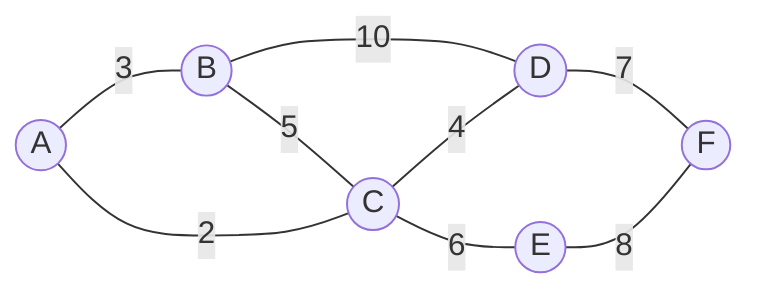
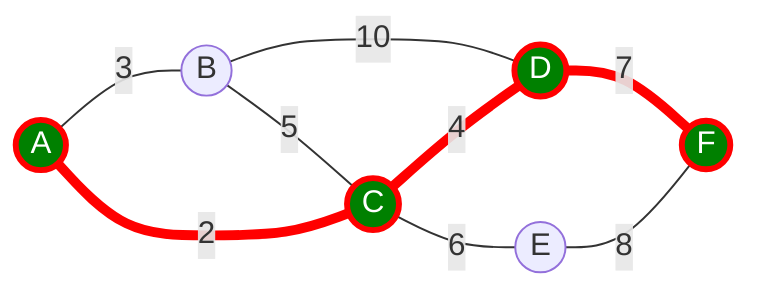
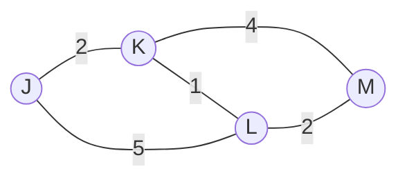
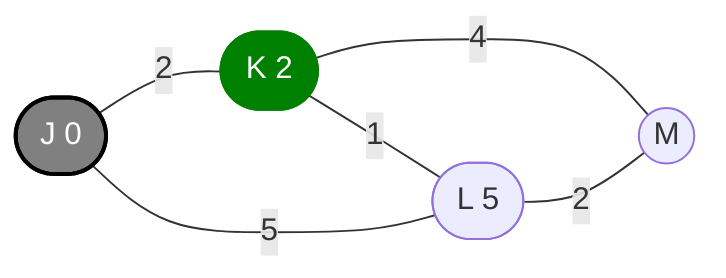
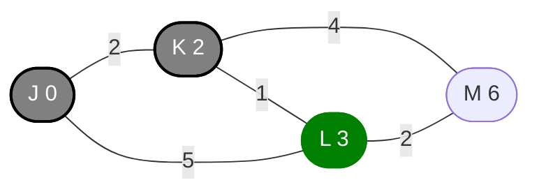
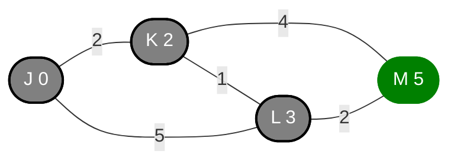

# Shortest Path Problems

## Dijkstra's Algorithm

---
layout: center
zoom: 1
---

# Shortest Path Problems

One of the most common problems in graphs is finding the shortest possible path between two vertices. This is called a **shortest path problem**.

What is the shortest path from A to F?

---
layout: center
---

# Shortest Path by Inspection

**By inspection** means looking at the graph and finding the shortest path by your own reasoning or intuition.

In this case:

the shortest path from A to F is **A → C → D → F** with a total weight of 2 + 4 + 7 = 13

However, **inspection is not always reliable** and should be used carefully, especially with larger graphs

---
layout: center
---

# Dijkstra's Algorithm

Dijkstra's algorithm is a method for finding the shortest path between two vertices in a graph.

## Dijkstra's algorithm steps

1. Assign the starting vertex a distance of 0. Unassigned vertices have a distance of infinity.
2. Mark the starting vertex as current.
3. Consider all **unvisited neighbors** of the current vertex, calculating their distance from the starting vertex. **If this distance is less than the previously recorded distance, update it.**
4. Once all neighbors have been considered, mark the current vertex as visited.
5. Find the unvisited vertex with the **smallest distance** and set it as the **new current vertex**, then go back to step 3.

The algorithm continues until the **destination vertex** has become the current vertex.

<!-- In the notes, write these steps out with the bolded items as blanks for students to fill in. Use a slightly larger font than usual -->

---
layout: two-cols-header
zoom: 0.88
---

## Dijkstra's Example

We'll try Dijkstra's algorithm on an example you wouldn't need to use it for, to learn the steps.

::left::

<v-clicks>

Set distance at J to 0. This is the current vertex.

Update the distances of the neighbors of J. The distance to K is 2 and the distance to L is 5.

K becomes the new current vertex.

</v-clicks>

::right::

<v-clicks>

 Update the distances of the neighbors of K.

L is updated to 3 (instead of 5) and M is updated to 6. L becomes the new current vertex.

We have reached the destintation vertex M. M was updated to 5 (instead of 6). The shortest path from J to M is **J → K → L → M** with a total weight of 5.

</v-clicks>

<!-- In the notes, just one graph, with a set of steps next to it with gaps for students to fill in -->

---
layout: center
---

# Alternate ways of recording Dijkstra's algorithm

Some people prefer to record the steps of Dijkstra's algorithm in a table rather than on the graph itself.

Our previous example would be recorded as follows:

|   | J | K | L | M |
|---|---|---|---|---|
| J | **0** | 2 | 5 |  |
| K |  | **2** | 3 | 6 |
| L |  |  | **3** | 5 |
| M |  |  | | **5** |

This allows you to identify the path of the algorithm more clearly, but some people find it harder than recording the steps on the graph itself.

---
layout: center
---

# More demos - using the camera and your notes

<!-- In the notes, we now need 2 more graphs of increasing complexity, asking students to find the shortest path between two nodes. The graph should be large on the page to allow for plenty of annotation. -->

---
layout: center
zoom: 1.2
---

# Questions

**Edrolo 8F p. 590**
Questions 1, 3, 4, 7, 8, 10, 11

> [!TIP]
>
> - Dijkstra's algorithm takes time and practice.
> - Some shortest path problems can be solved just using inspection, and when you are confident in your ability to do that, it saves you time.
> - Find the method of recording Dijkstra's algorithm that works best for you.
